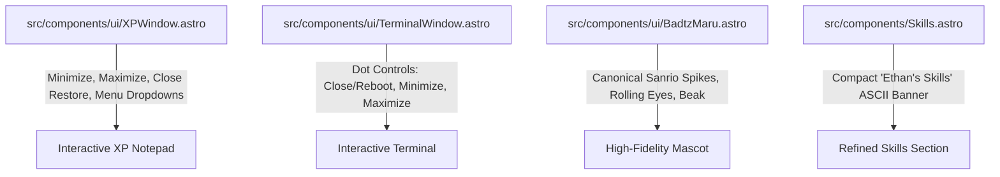

# Implementation Plan: Interactive Window Controls, Badtz-Maru Accuracy & Terminal Polish

This plan addresses user feedback regarding functional window controls, Badtz-Maru design fidelity, compact terminal ASCII branding, and contact form setup verification.

---

## Goal Description

Enhance the tactile personality and usability of the portfolio through 4 key improvements:
1. **Interactive Window Controls (XP & Terminal)**:
   - **Minimize**: Collapses the window body down to just the header; clicking again (or clicking the title bar) restores it.
   - **Maximize / Expand**: Toggles between default width and an expanded wider view for immersive reading.
   - **Close with Playful Restore**: Clicking the close button (`✕` on XP, red dot on Terminal) plays a swift fade/scale exit animation, followed 1.5 seconds later by a playful toast notification (*"Restoring about_ethan.txt..."*) that smoothly restores the window.
   - **XP Notepad Menu Bar Dropdowns**: Functional dropdowns for `File`, `Edit`, `Format`, `View`, and `Help`:
     - `File`: **Save As...** (downloads `about_ethan.txt`), **Print...** (`window.print()`), **Exit** (triggers playful close).
     - `Edit`: **Copy All** (copies bio to clipboard with toast confirmation), **Select All**.
     - `Format`: **Word Wrap** toggle, **Toggle Font** (Notepad Lucida/Courier vs. Modern Sans).
     - `View`: **Status Bar** toggle (classic bottom bar: `Ln 1, Col 1 | 100% | Windows (CRLF) | UTF-8`).
     - `Help`: **About Notepad** (authentic Windows XP About dialog modal).
   - **Terminal Dot Controls**: Red (close & reboot), Yellow (minimize), Green (maximize).
2. **Badtz-Maru Accuracy Overhaul**:
   - Redraw Badtz-Maru in SVG strictly matching Sanrio's canonical proportions:
     - 4 distinct spiky black hair crests.
     - Signature mischievous wide white eyes with pupils rolling upward/sideways.
     - Down-curved rounded yellow beak.
     - Proper penguin body proportions, white oval tummy patch, and yellow webbed feet.
3. **Refined Terminal ASCII Art**:
   - Update the ASCII art in `Skills.astro` from "ETHAN" to a compact, proportionate **"Ethan's Skills"** banner that fits neatly on all screen sizes without taking attention away from `stack.json`.
4. **Contact Form Architecture & Verification**:
   - Provide clear explanation of how the Web3Forms access key `8d3f53a2-d7a1-44ce-9703-9b5d0c4a44fe` works, confirm it is operational, and guide how to test it.

---

## User Review Required

> [!IMPORTANT]
> **Window State Persistence**:
> All interactive window actions (minimize, maximize, font toggle) are designed to be temporary client-side interactions that reset upon full page refresh, ensuring visitors always see the complete content on initial load while enjoying delightful tactile micro-interactions during their session.

> [!TIP]
> **Web3Forms Contact Form Status**:
> - The access key `8d3f53a2-d7a1-44ce-9703-9b5d0c4a44fe` in `src/components/Contact.astro` was carried over directly from your previous site (`ethanrvillanueva.github.io`).
> - **It is active and fully functional right now!** When someone submits the form, Web3Forms processes the request and sends the message directly to your email (`e.villanueva.cs@outlook.com`).
> - You can test it immediately on `localhost:4321` by typing a message and clicking "Send Message". You will see an instant success alert and receive an email.

---

## Open Questions

> [!TIP]
> 1. **XP Window Maximize Style**:
>    - **Option A (Recommended)**: Maximize expands the window within the page container to full width (`max-w-none` with heightened notepad view).
>    - **Option B**: Maximize opens a full-screen retro desktop overlay modal.
>    *(We recommend Option A for seamless in-page scrolling and usability).*

> User answers:
  1. Option A.

---

## Proposed Changes



---

### Component 1: Interactive XP Window & Classic Menu Bar

#### [MODIFY] `src/components/ui/XPWindow.astro`
- Add interactive state management in component script:
  - **Minimize Button (`_`)**: Toggles `.window-body` collapse (`hidden` or `max-h-0`). Adds a minimized indicator and allows clicking anywhere on the title bar to restore.
  - **Maximize Button (`□` / `❐`)**: Toggles expanded width class and swaps icon to classic restore double-box `❐`.
  - **Close Button (`✕`)**:
    - Adds `.xp-closing` CSS class (scale down to 95% + fade out).
    - Renders a floating XP toast / tooltip: *"Restoring about_ethan.txt..."*.
    - Re-appears automatically with a spring bounce after 1.5 seconds.
  - **Menu Bar Dropdowns**:
    - Implement dropdown menus for `File`, `Edit`, `Format`, `View`, `Help`:
      - `File -> Save As...`: Triggers client download of `about_ethan.txt`.
      - `File -> Print...`: Invokes `window.print()`.
      - `Edit -> Copy`: Copies notepad text to clipboard with `"Copied!"` indicator.
      - `Format -> Font`: Toggles between retro monospace (`Courier New`, `Lucida Console`) and modern font.
      - `View -> Status Bar`: Toggles bottom XP status bar.
      - `Help -> About Notepad`: Opens modal with authentic Windows XP Notepad icon and info.
    - Click outside listener to dismiss open dropdown menus.

---

### Component 2: Interactive Terminal Window Controls

#### [MODIFY] `src/components/ui/TerminalWindow.astro`
- Add click handlers for the 3 colored macOS dots:
  - **Red dot (Close)**: Terminal flashes, runs a 1.2-second restart sequence (`[Process terminated] -> Reopening shell...`), and restores cleanly.
  - **Yellow dot (Minimize)**: Collapses the terminal body, leaving just the title bar.
  - **Green dot (Maximize)**: Expands terminal width/height within the layout.

---

### Component 3: Badtz-Maru Canonical Accuracy Redraw

#### [MODIFY] `src/components/ui/BadtzMaru.astro`
- Redraw Badtz-Maru SVG:
  - Exactly **4 pointed hair spikes** with the correct angle and geometry.
  - Large expressive **white oval eyes** with pupils positioned upward-sideways for his signature sarcastic/mischievous rolling-eye stare.
  - Distinct yellow beak with curved top and rounded lower tip.
  - Symmetrical black body with clean white oval tummy patch.
  - Two yellow webbed feet.
  - Pixel-perfect rendering matching authentic Sanrio art.

---

### Component 4: Compact "Ethan's Skills" Terminal ASCII Banner

#### [MODIFY] `src/components/Skills.astro`
- Replace the current "ETHAN" banner with a compact, legible **"Ethan's Skills"** banner:
```
  ___ _   _                 _       ____  _     _ _ _     
 | __| |_| |_  __ _ _ __  ( )___   / ___|| |__ (_) | |___ 
 | _||  _| ' \/ _` | '_ \ |// __|  \___ \| / / | | | / __|
 |___|\__|_||_\__,_|_| |_|  \___/  |____/|_\_\_|_|_|_\___|
```
- Set font size to `text-[9px] sm:text-[11px]` so it fits cleanly on mobile and desktop without pushing the JSON stack out of the viewport.

---

## Verification Plan

### Automated Tests
```powershell
$env:PATH = "C:\Program Files\nodejs;" + $env:PATH; npm.cmd test
```
Update and add tests in `tests/personality.test.ts` and `tests/enhancements.test.ts`:
- Verify XPWindow has controls for minimize, maximize, and close.
- Verify XPWindow contains menu bar dropdown triggers (`File`, `Edit`, `Format`, `View`, `Help`).
- Verify TerminalWindow has clickable dot handlers.
- Verify BadtzMaru SVG contains canonical elements (4 spikes, rolling eye pupils, beak).
- Verify Skills component contains "Ethan's Skills" ASCII string.

### Build Verification
```powershell
$env:PATH = "C:\Program Files\nodejs;" + $env:PATH; npm.cmd run build
```
Verify 0 build warnings or errors across all routes.

### Manual Verification
1. Open `http://localhost:4321`.
2. In the About section (XP Window):
   - Click `_` (minimize) -> window body collapses; click again -> restores.
   - Click `□` (maximize) -> window expands; click `❐` -> restores.
   - Click `✕` (close) -> window shrinks/fades, toast appears, window pops back up after 1.5s.
   - Click `File` -> click `Save As...` -> verify `about_ethan.txt` downloads with bio text!
   - Click `Edit` -> click `Copy` -> verify clipboard gets bio text.
   - Click `Help` -> click `About Notepad` -> view classic dialog.
3. In the Terminal Window:
   - Click red dot -> verify terminal reboots.
   - Click yellow dot -> verify collapse/restore.
4. Check Badtz-Maru:
   - Verify 4 hair spikes and signature side-eye expression.
5. In Contact section:
   - Submit a test message to verify Web3Forms live response.
